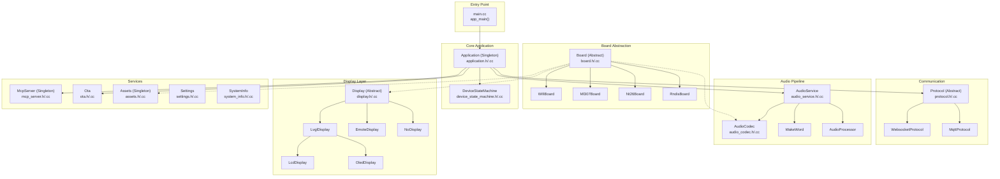
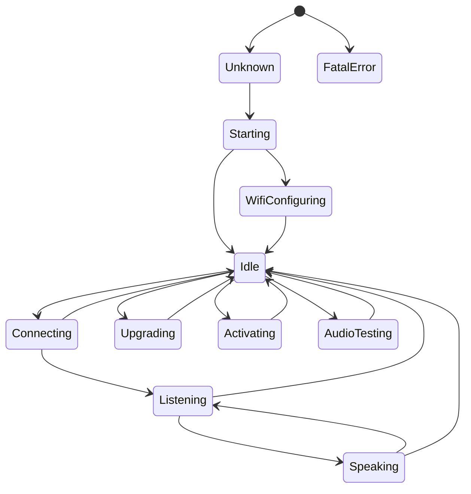
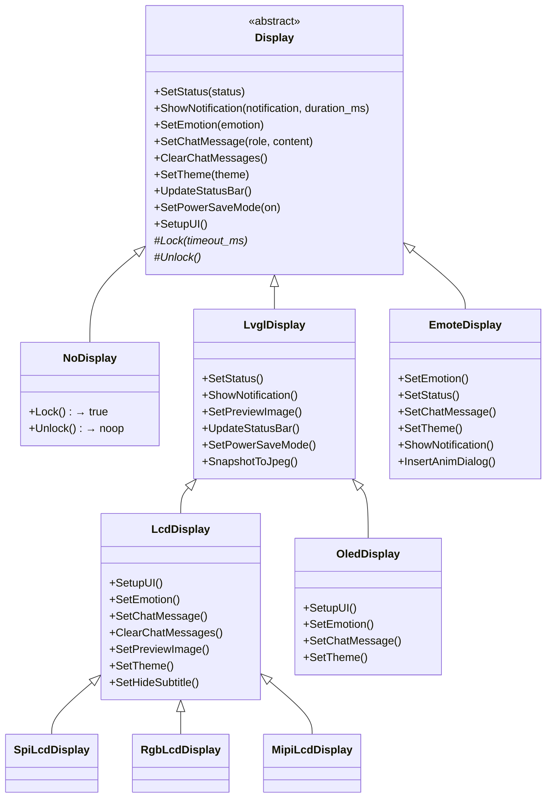
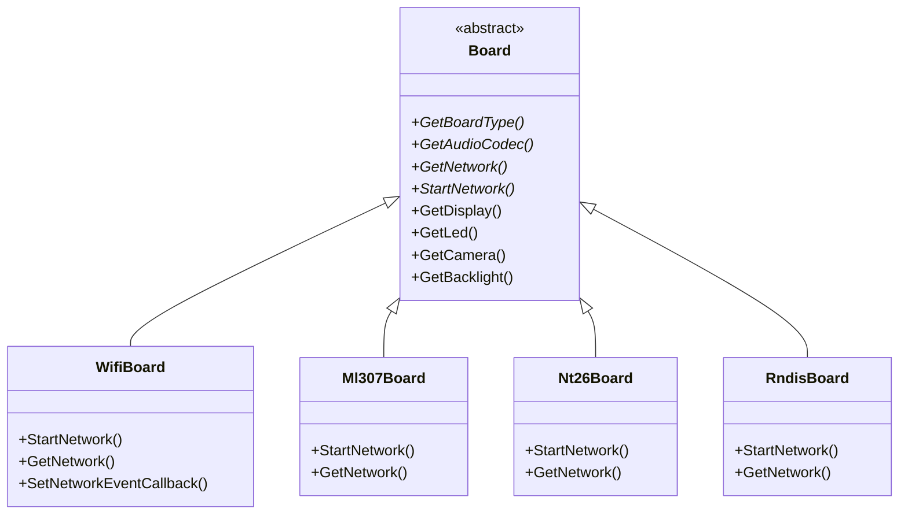
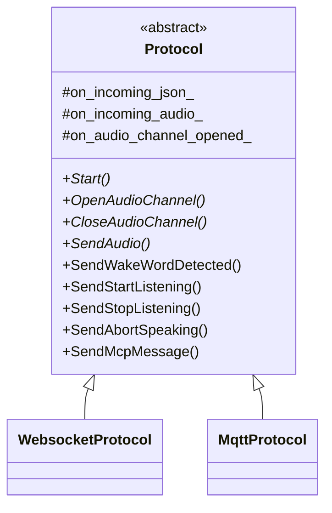
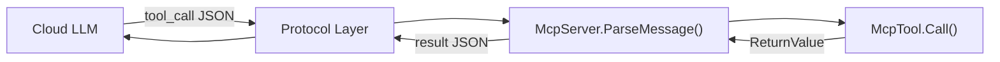
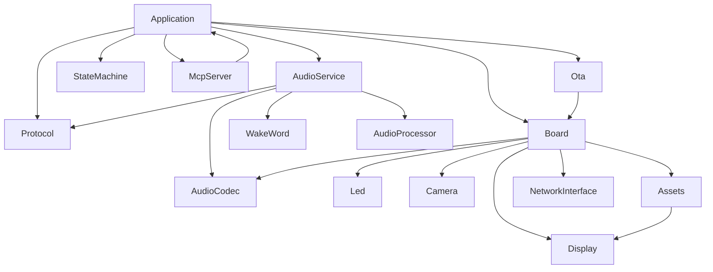
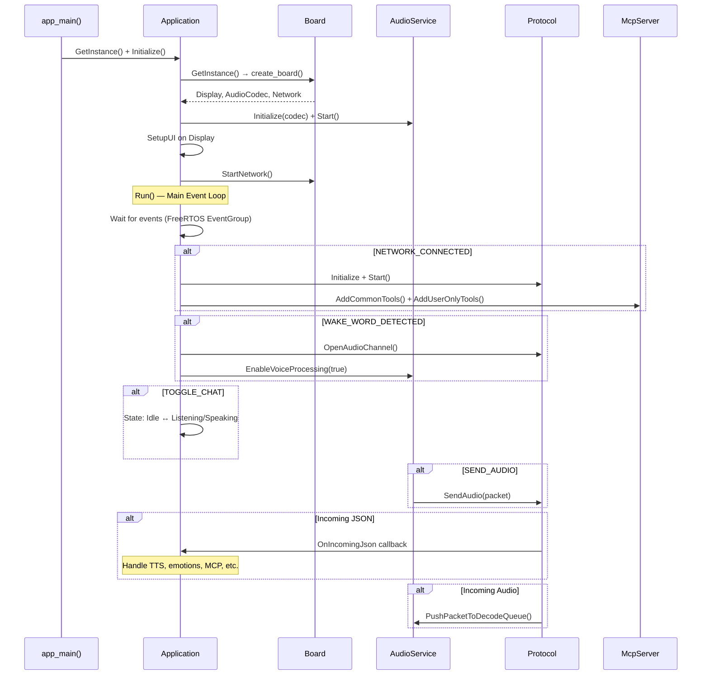

# Jarvis-ESP32 (XiaoZhi AI Chatbot) — Full Codebase Analysis

## 1. Project Overview

| Attribute | Value |
|---|---|
| **Project Name** | `xiaozhi` (XiaoZhi AI Chatbot) |
| **Version** | `2.2.5` |
| **Language** | C++ (ESP-IDF framework) |
| **Build System** | CMake + ESP-IDF Component Manager |
| **SDK** | ESP-IDF ≥ 5.5.2 |
| **Target Chips** | ESP32, ESP32-C3, ESP32-C5, ESP32-C6, ESP32-S3, ESP32-P4 |
| **Source Files** | 533 (.h/.cc/.c/.cpp) |
| **Lines of Code** | ~94,134 |
| **License** | MIT |
| **Current Branch** | `modify-display-screen` |

**Purpose**: An MCP-based voice AI chatbot running on ESP32 hardware. It leverages cloud LLMs (Qwen, DeepSeek, etc.) via streaming ASR + LLM + TTS, with device-side MCP for IoT control. Supports 97+ board configurations, OLED/LCD/Emote displays, multiple communication protocols, and OTA updates.

---

## 2. Architecture Overview



---

## 3. Directory Structure

```
jarvis-esp32/
├── CMakeLists.txt                    # Root build file (v2.2.5)
├── sdkconfig.defaults*               # Per-chip SDK defaults
├── partitions/                       # Flash partition tables (v1, v2)
├── scripts/                          # Build/tooling scripts
│   ├── build_default_assets.py       # Asset generation
│   ├── gen_lang.py                   # Language file generator
│   └── ...
├── docs/                             # Protocol/board documentation
│   ├── websocket.md                  # WebSocket protocol spec
│   ├── mqtt-udp.md                   # MQTT+UDP protocol spec
│   ├── mcp-protocol.md              # MCP protocol spec
│   ├── custom-board.md              # Board creation guide
│   └── ...
└── main/                             # ★ Primary source directory
    ├── main.cc                       # Entry point (app_main)
    ├── application.{h,cc}            # Core singleton, event loop
    ├── device_state.h                # State enum
    ├── device_state_machine.{h,cc}   # State machine with listeners
    ├── mcp_server.{h,cc}             # MCP tool framework
    ├── ota.{h,cc}                    # OTA + activation
    ├── assets.{h,cc}                 # Asset management (LVGL/Emote strategies)
    ├── settings.{h,cc}               # NVS-backed settings
    ├── system_info.{h,cc}            # System diagnostics
    ├── Kconfig.projbuild             # 957-line menuconfig (boards, languages, etc.)
    ├── idf_component.yml             # 60+ component dependencies
    ├── audio/                        # Audio subsystem
    │   ├── audio_service.{h,cc}      # Main audio orchestrator
    │   ├── audio_codec.{h,cc}        # Codec abstraction
    │   ├── codecs/                   # Codec implementations
    │   ├── processors/               # Audio processing (AEC, noise reduction)
    │   ├── wake_words/               # Wake word engine implementations
    │   └── demuxer/                  # OGG demuxer
    ├── display/                      # Display subsystem
    │   ├── display.{h,cc}            # Abstract base class
    │   ├── lcd_display.{h,cc}        # LCD (SPI/RGB/MIPI) display
    │   ├── oled_display.{h,cc}       # OLED (SSD1306/SH1106) display
    │   ├── emote_display.{h,cc}      # Emote animation display
    │   └── lvgl_display/             # LVGL framework layer
    │       ├── lvgl_display.{h,cc}   # LVGL base class
    │       ├── lvgl_theme.{h,cc}     # Theme management
    │       ├── lvgl_font.{h,cc}      # Font handling
    │       ├── lvgl_image.{h,cc}     # Image handling
    │       ├── emoji_collection.*    # Emoji system
    │       ├── gif/                  # GIF rendering
    │       └── jpg/                  # JPEG rendering
    ├── protocols/                    # Communication protocols
    │   ├── protocol.{h,cc}           # Abstract protocol
    │   ├── websocket_protocol.*      # WebSocket implementation
    │   └── mqtt_protocol.*           # MQTT+UDP implementation
    ├── boards/                       # 97 board configurations
    │   ├── common/                   # Shared board infrastructure
    │   │   ├── board.{h,cc}          # Abstract Board class
    │   │   ├── wifi_board.*          # WiFi board base
    │   │   ├── ml307_board.*         # ML307 4G board base
    │   │   ├── nt26_board.*          # NT26 4G board base
    │   │   ├── rndis_board.*         # RNDIS board base
    │   │   ├── button.*              # Button handling
    │   │   ├── backlight.*           # Backlight control
    │   │   ├── esp32_camera.*        # Camera support
    │   │   └── ...                   # Battery, power, sleep, etc.
    │   ├── esp-box-3/                # Example: ESP-BOX-3 board
    │   ├── atoms3r-echo-base/        # Example: M5Stack AtomS3R
    │   └── ... (95 more boards)
    ├── led/                          # LED subsystem
    │   ├── led.h                     # LED interface
    │   ├── single_led.*              # Single LED driver
    │   ├── circular_strip.*          # LED strip (WS2812, etc.)
    │   └── gpio_led.*                # GPIO-based LED
    └── assets/                       # Runtime assets
        ├── common/                   # Shared assets
        └── locales/                  # i18n translations
```

---

## 4. Device State Machine

The device operates through a well-defined state machine:



| State | Description |
|---|---|
| `kDeviceStateUnknown` | Initial/uninitialized |
| `kDeviceStateStarting` | Boot sequence |
| `kDeviceStateWifiConfiguring` | WiFi setup mode (BluFi/SonicConfig) |
| `kDeviceStateIdle` | Ready, waiting for wake word or button |
| `kDeviceStateConnecting` | Connecting to server |
| `kDeviceStateListening` | Capturing audio from mic |
| `kDeviceStateSpeaking` | Playing TTS response |
| `kDeviceStateUpgrading` | OTA firmware update in progress |
| `kDeviceStateActivating` | Device activation flow |
| `kDeviceStateAudioTesting` | Audio hardware testing |
| `kDeviceStateFatalError` | Unrecoverable error |

---

## 5. Key Class Hierarchies

### 5.1 Display Hierarchy



### 5.2 Board Hierarchy



Each of the 97 board directories contains a concrete board class that inherits from one of the network base classes (usually `WifiBoard` or `Ml307Board`) and configures specific hardware (GPIO pins, display type, codec, etc.).

### 5.3 Protocol Hierarchy



---

## 6. Audio Pipeline

The audio subsystem manages two directional data flows:

```
┌─────────────────────── INPUT PATH ────────────────────────┐
│ MIC → [AudioProcessor] → {Encode Queue} → [OPUS Encoder] │
│        (noise reduction,        ↓                          │
│         AEC, VAD)        {Send Queue} → Server             │
└────────────────────────────────────────────────────────────┘

┌─────────────────────── OUTPUT PATH ───────────────────────┐
│ Server → {Decode Queue} → [OPUS Decoder] → {Playback Queue} → Speaker │
└───────────────────────────────────────────────────────────────────────┘
```

**Key parameters:**
- OPUS frame duration: 60ms
- Encoder sample rate: 16kHz mono 16-bit
- Max queues: 2 encode tasks, 2 playback tasks, ~40 decode/send packets

**Three FreeRTOS tasks:**
1. `AudioInputTask` — Reads from mic, runs processors, pushes to encode queue
2. `AudioOutputTask` — Reads from playback queue, writes to speaker
3. `OpusCodecTask` — Handles both encoding and decoding

---

## 7. MCP Server Framework

The device-side MCP server (`McpServer`) implements the [Model Context Protocol](https://modelcontextprotocol.io/) for tool-based IoT control:



**Tool registration** supports:
- `Property` types: `boolean`, `integer` (with optional min/max range), `string`
- Return types: `bool`, `int`, `std::string`, `cJSON*`, `ImageContent*` (base64)
- User-only tools (invisible to AI, visible to user)
- Common tools (LED, Speaker, GPIO, Servo control) + user-only tools (volume, brightness)

---

## 8. Dependency Map

### External ESP-IDF Components (from `idf_component.yml`)

| Category | Components |
|---|---|
| **Display Drivers** | `esp_lcd_*` (20+ LCD/OLED drivers), `lvgl 9.5`, `esp_lvgl_port`, `esp_mmap_assets` |
| **Audio** | `esp_audio_codec`, `esp_audio_effects`, `esp_codec_dev`, `esp-sr` (speech recognition) |
| **Network** | `esp-wifi-connect`, `esp-ml307` (4G), `uart-eth-modem`, `esp_hosted`, `iot_usbh_rndis` |
| **Input** | `button`, `knob`, `esp_lcd_touch_*` (6 touch drivers) |
| **Camera** | `esp32-camera`, `esp_video`, `esp_image_effects` |
| **Display Special** | `esp_emote_expression`, `image_player`, `esp_new_jpeg`, `xiaozhi-fonts` |
| **Peripherals** | `led_strip`, `adc_battery_estimation`, `bmi270_sensor`, `servo_dog_ctrl` |

### Internal Module Dependencies



---

## 9. Configuration System

### Kconfig Menu Structure (~957 lines)

The project uses ESP-IDF's Kconfig for compile-time configuration:

1. **OTA URL** — Server endpoint
2. **Flash Assets** — None / Default / Custom / Emote
3. **Language** — 30+ languages (Chinese, English, Japanese, Vietnamese, etc.)
4. **Board Type** — 97+ board options, chip-specific
5. **Display Options** — OLED type, LCD type, display style (Default/WeChat/Emote), multiline chat
6. **Wake Word** — Disabled / Wakenet (no AFE) / AFE Wakenet / Custom Multinet
7. **Audio Processing** — Noise reduction, Device-side AEC
8. **Connection Protocol** — WebSocket / MQTT+UDP

### Settings (NVS-backed runtime)

The `Settings` class wraps NVS flash for runtime configuration:
- String, Int32, Bool key-value storage
- Namespace-scoped
- Read-write or read-only modes

---

## 10. Board Support Matrix (97 boards)

> [!NOTE]
> Each board is a separate directory under `main/boards/` containing a board header, source file, and `config.json`.

| Chip | Board Count | Examples |
|---|---|---|
| **ESP32-S3** | ~60 | ESP-BOX-3, M5Stack CoreS3, Waveshare AMOLED, Magiclick, LiChuang Dev |
| **ESP32-C3** | ~8 | XMini C3, ESP-HI, Kevin C3, Magiclick C3, Surfer C3 |
| **ESP32** | ~5 | Bread Compact ESP32, CGC, AtomMatrix+Echo |
| **ESP32-P4** | ~10 | ESP-P4-Function-EV, M5Stack Tab5, LILYGO T-Display-P4, WTP4C5MP07S |
| **ESP32-C5** | ~2 | ESP-SensairShuttle, Movecall Moji2 |
| **ESP32-C6** | ~8 | Waveshare C6 AMOLED/LCD variants |

### Network Types
- **WiFi** — Most boards
- **ML307/EC801E** — 4G CAT.1 cellular
- **NT26** — 4G alternative
- **RNDIS** — USB network

---

## 11. Key Execution Flow



---

## 12. Assets System

The `Assets` class uses a **Strategy Pattern** for different display types:

| Strategy | Use Case |
|---|---|
| `LvglStrategy` | LVGL-based displays (LCD/OLED). Memory-maps partition, validates checksums, loads fonts/emojis/backgrounds |
| `EmoteStrategy` | Emote-style displays. Loads expression animation data |

**Asset partition**: Stored in flash, downloadable OTA. Contains wake word models, fonts, emoji PNGs, GIF animations, and display themes.

---

## 13. Code Metrics Summary

| Metric | Value |
|---|---|
| Total source files | 533 |
| Total lines of code | ~94,134 |
| Board configurations | 97 |
| Supported languages | 30+ |
| External components | 60+ |
| Largest file | `lcd_display.cc` (53.7 KB) |
| Key singletons | `Application`, `Board`, `McpServer`, `Assets` |
| FreeRTOS tasks | ~5 (main, audio input, audio output, opus codec, activation) |

---

## 14. Key Design Patterns

| Pattern | Usage |
|---|---|
| **Singleton** | `Application`, `Board`, `McpServer`, `Assets` |
| **Observer** | `DeviceStateMachine` state change listeners |
| **Strategy** | `Assets` (LvglStrategy vs EmoteStrategy) |
| **Abstract Factory** | `create_board()` via `DECLARE_BOARD()` macro |
| **Template Method** | Display hierarchy (SetupUI, Lock/Unlock) |
| **Event-Driven** | FreeRTOS EventGroup for main loop events |
| **Producer-Consumer** | Audio queues between tasks |
| **Callback** | Protocol events, audio service events |
